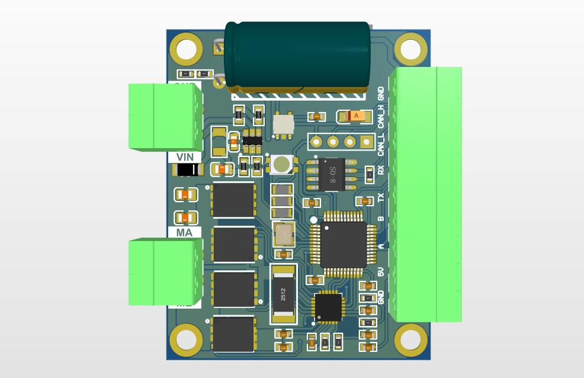
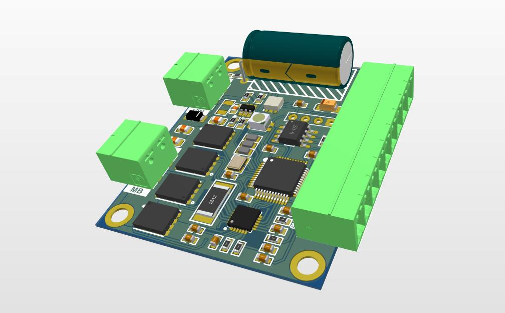
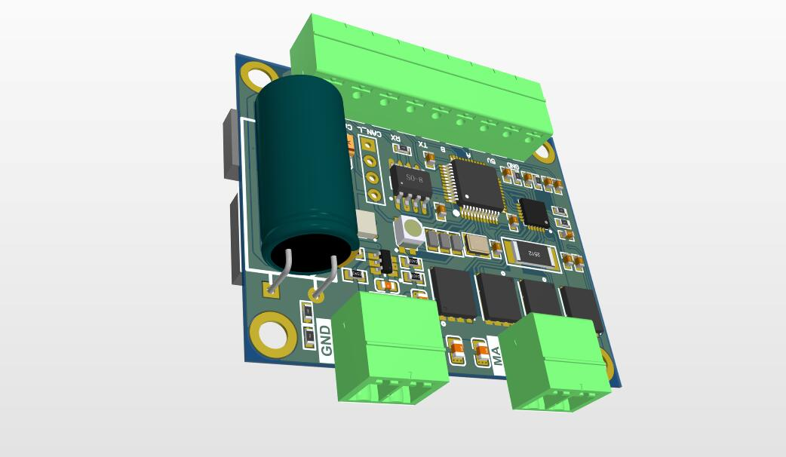
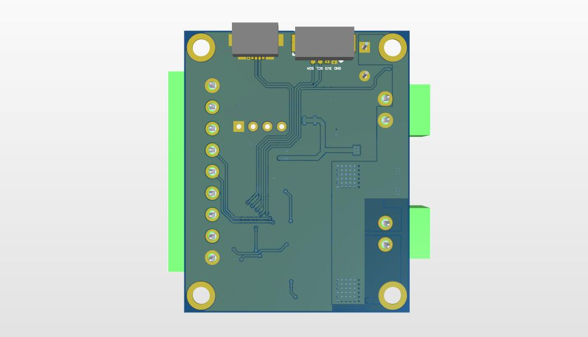
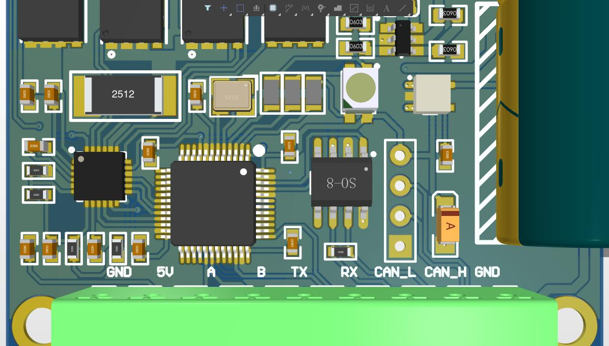

# SmartDrive_BDC
智驱 直流有刷电机版本（SmartDrive - Brushed DC）

> 773673787@qq.com

**综述**

该驱动是 **智驱系列** 的直流有刷电机版本，该版本具有使用了DRV8701大功率全三极驱动器，CDS5A大功率驱动，长时间负载能力在最高36V、持续10A 之间，24KHZWM调速，三环控制，

**功能特点**

- 支持电压**6V～24V**，精巧尺寸，尺寸仅仅为4MMX4MM
- 一键电机相序适配**，温度监测，最大**可2倍额定电流输出**，大启动力矩**
- **支持CAN总线通讯；1MHZ频率支持
- 支持电机**过载限流、堵转停机、温度测量、过热限流/保护。**
-  电机电流PID调节控制，最大启动/负载电流、制动电流可分别配置；
- 支持**电位器与开关、模拟信号与逻辑电平、PWM/频率/脉冲信号、RS485**多种输入信号
- 支持**占空比调速(调压)、速度闭环控制(稳速)、位置闭环控制(步进/伺服)、力矩控制(限流)**多种调速方式
- 支持**加减速缓冲时间与加减速加速度控制**，可在指定行程内自动加减速并**精确定位**
- 支持单电位器、双电位器独立、双电位器比较控制正反转速度
- 支持模拟信号电压范围配置与逻辑电平电压配置，模拟信号支持0~3.3V电压范围，**逻辑电平可支持0~24V**等电压；支持模拟信号线性度调整与逻辑电平阈值配置
- 支持**外部PWM、频率信号对电机调速**，支持**外部脉冲信号对电机进行步进控制**
- 支持外接**限位开关限位和堵转限位**
- 24kHz的PWM频率，电机调速**无PWM嚣叫声**

**电气参数**

| **项目**                 | **参数**                                                     |
| ------------------------ | ------------------------------------------------------------ |
| 电源输入电压             | DC 9V～24V                                                   |
| 额定输出电流             | 8A；3A                                                       |
| 最大输出电流             | 额定8A款：10A（非倍流）/16A（倍流输出）； 额定3A款：4A（非倍流）/6A（倍流输出） |
| 霍尔传感器接口电压       | 5V                                                           |
| 最大软制动电流           | 3A                                                           |
| 输出通道数               | 单路                                                         |
| 电位器阻值               | 10K～50K                                                     |
| 输入信号端口接受电压范围 | -0.5V～25V (故障/完成信号输出端口除外)                       |
| 模拟信号范围             | 0～3.3V范围内任意                                            |
| 数字信号电压范围         | 0～24V范围内任意，LvTTL，TTL，HvTTL等                        |
| PWM输入信号支持频率范围  | 100Hz～10kHz；注：输出PWM频率固定18kHz                       |
| 频率输入信号支持范围     | 0～10kHz                                                     |
| 输出PWM频率              | 18kHz                                                        |
| 输出PWM分辨率            | 1/1000                                                       |
| 电流检测分辨率           | 0.04A                                                        |
| 稳流控制精度             | 0.1A                                                         |
| 占空比调速范围           | 0～100.0%                                                    |
| 稳速控制调节范围         | -3276.8～3276.7Hz                                            |
| 位置控制调节范围         | -2147483648～2147483647                                      |
| 转矩控制调节范围         | 0～额定电流                                                  |
| 软启动/软制动            | 支持；可限流启动、制动及设定加减速时间与加速度               |
| 过流/堵转保护            | 支持；过流时限流输出；堵转时可停机                           |
| 输出短路保护             | 可配置                                                       |
| 制动动作时间             | 软制动通常0.1s～0.3s                                         |
| 主板工作温度             | -25℃～85℃                                                    |

**通信方式**

- CAN总线，使用SmartDrive SDK可以快速的集成到系统中，使用起来非常方便。
- *USART*（串口），默认115200通信速率，使用SmartDrive SDK。
- USB，使用VCP协议直接连接电脑，与上位机进行通信，可直接对控制器进行调试，配置参数。

**SmartDrive SDK**

SmartDrive SDK是专为SmartDrive系列驱动器开发的通信协议，支持CAN 和 USART两种方式通信，现主要支持STM32 F1、F4系列，使用HAL库。

为了使SmartDrive系列驱动的开发变得简单，自带了很多例程，对通信协议部分做了单独的解耦合，确保使用HAL库的用户可以很轻松的移植上手。 

